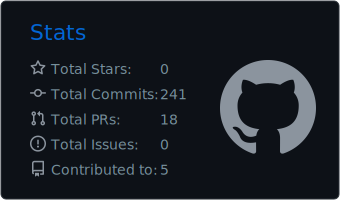
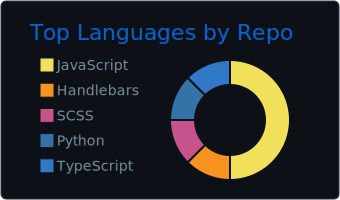

<h2 align="left">About Me</h2>

###

Hi there! 👋  Welcome my profile!  - Passionate about Technology and Programming! - Interest in Full Stack Development - Strong Problem-Solving Skills 

###

<h2 align="left">Stats</h2>

###

  
  

###

<h2 align="left">Social Media</h2>

<table border="0">
  <tr>
    <td>
      
    </td>
    <td>
      
    </td>
    <td>
      
    </td>
    <td>
      
    </td>
  </tr>
</table>

###
